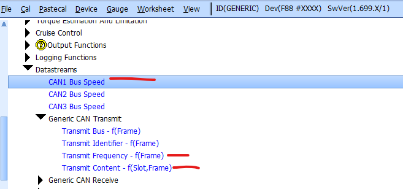
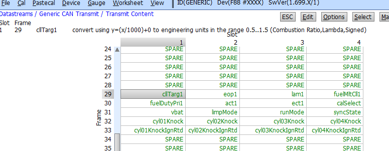
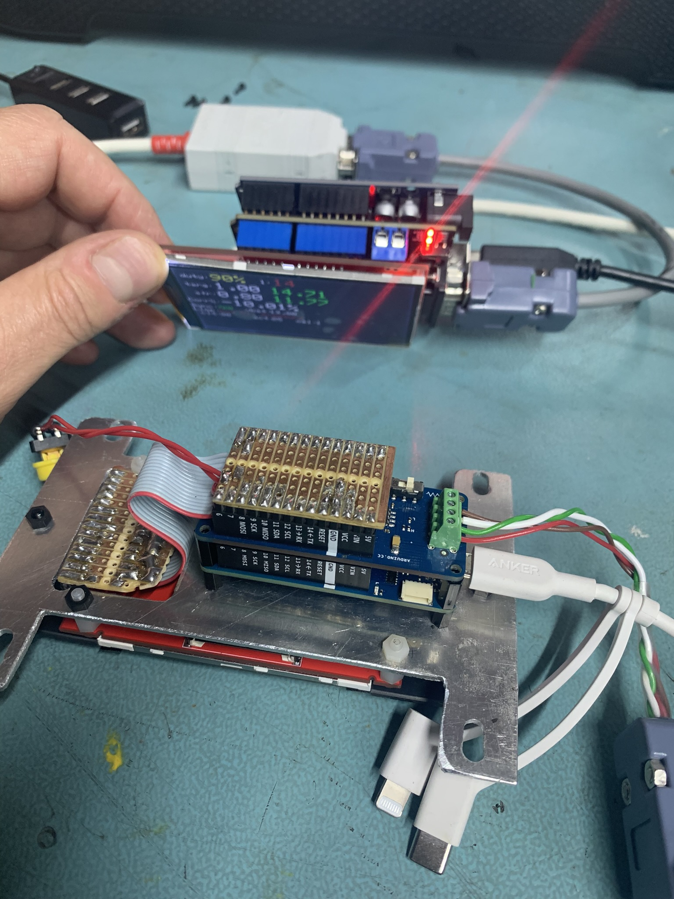
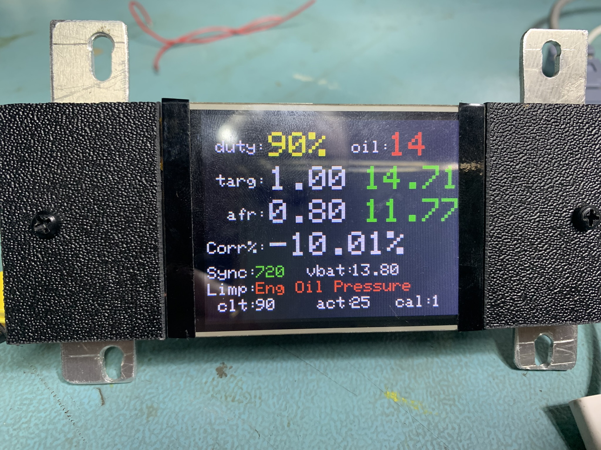
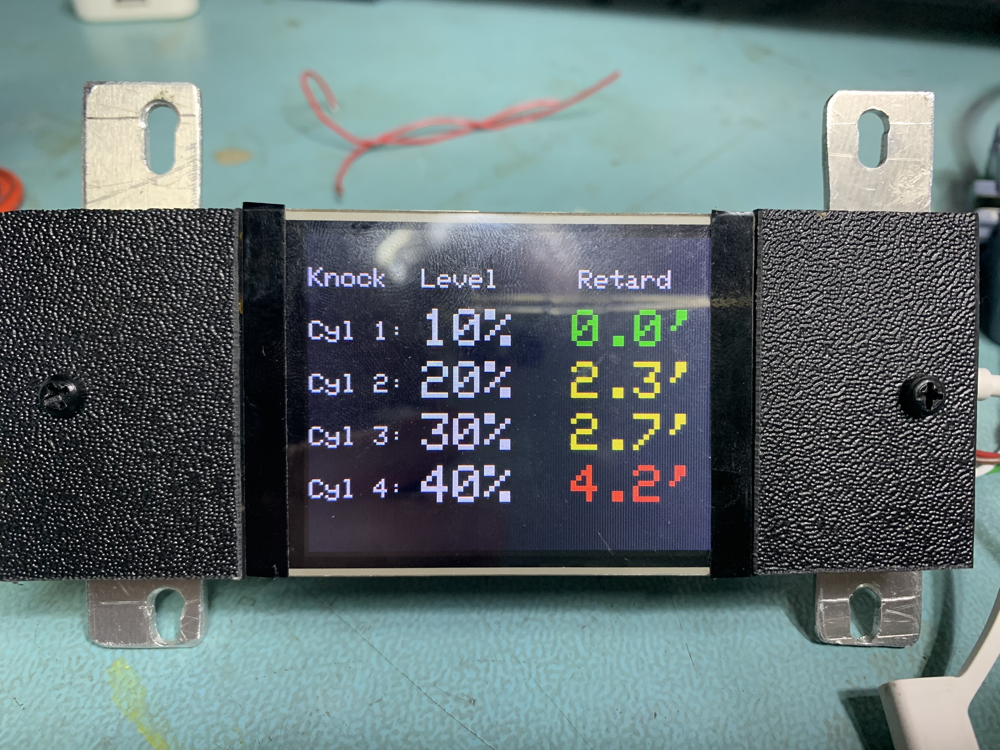

# ArduinoCAN
A repo containing code for an Arduino with a CAN adapter to read and display engine parameters on a display of your choice.

I started out with some code samples that accompany the can shields, which worked to a degree - but once you started sending more frames to the device you would end up with timing issues where frames would be arriving but the code was busy displaying the data and would therefore miss the new frames.
I thought this was a CPU issue, so I changed from an UNO to a MKR0 board - it worked a bit better, but you could tell the problem wasn't solved.  I did look at using interrupts instead, but it still seemed to have the same issue.

In the end I (well to be honest, ChatGPT did) refactored the code to wait for all the known frames to arrive and only then drop into the routine that displays the data before returning and waiting for another complete set of frames

Typically with CAN bus, you would transmit fast changing data far more frequently than slow changing data (such as oil pressure, battery volts, selected map, run mode etc) - but with my code, it waits for all frames to arrive before doing anything - so all frames need to be transmitted at the same frequency.

This code was written to display CAN data from my Life Racing F88RS, which is essentially the same as a Syvecs S8, in theory you should be able to adapt it to display data from any ECU if you know the CAN frame ID's and the data within - or you set your ECU to send the data in the same format as the Life ECU.

## Features
- Multiple screens, press a button to toggle screens
- Text changes colour for danger values: Oil Pressure, Injector Duty % and Knock retard
- Full readout of limp modes (limpmode)
- Engine sync state (runmode)
- Lambda (lam1)
- AFR Target (cllTarg1)
- Current correction to hit AFR target (fuelMltCll1)
- Battery Voltage (vbat)
- Injector Duty Cycle (fuelDutyPri1)
- Calibration Selection (calselect)
- Knock Level (cylxxKnock)
- Knock Retard Degrees (cylxxKnockIgnRtd)

## ECU and CAN Details - Life Racing / Syvecs ECU
Transmit Content (Not all are used)
| Frame Number  | SLOT1          |SLOT2           |SLOT3           |SLOT4           |
| ------------- | -------------- | -------------  | -------------  | -------------  |
| 61C           | cllTarg1       | ot             | lam1           | fuelMltCll1    |
| 61D           | fuelDutyPri1   | act1           | ect1           | calSelect      |
| 61E           | vbat           | limpmode       | runMode        | syncState      |
| 61F           | cyl01Knock     | cyl02Knock     | cyl03Knock     | cyl04Knock     |
| 620           |cyl01KnockIgnRtd|cyl02KnockIgnRtd|cyl03KnockIgnRtd|cyl04KnockIgnRtd|
                

These are the sections we are interested in:
- CAN Speed: 250KHZ- code and hardware will support up to 1MHZ
- Transmit Identifier base address: 600h, I started at slot 29 (61C) for no particular reason.

Which frames to transmit - each frame has a "convert using xxx" explanation which was essential for processing the data.

How often to transmit the frames  - could go faster

- uno-tftshield-life-display-buffered-multiscreen
- mkr0-life-display-buffered-multiscreen

## Hardware

You have two options, solder free or soldering / diy.

### Arduino Uno using shields
Simply plug them altogether and you are done.  This is a 5V solution and uses discrete IO to drive the display NOT SPI - there are no spare digital pins left.
- Arduino Uno R3
- MCP2515 EF02037 TJA1050 CAN Bus Shield Receiver SPI Controller 
- 3.5" TFT LCD 480x320 Display Shield for Arduino UNO R3 MEGA2560

### Arduino MKR Zero diy solder
I built this because I thought the UNO was too slow, but that turned out to be my bad code. The display fitted my dashboard better as well, so no bad thing.

One thing to be aware of, the wires between the Arduino and display need to be relatively short and i used every other wire in the ribbon cable as a ground - otherwise the display wouldn't work with longer wires. The wiring details are in the source code.

- Arduino MKR CAN Shield 
- Arduino MKR Zero
- ILI9341 2.8" COLOUR TFT 240x320 Display Panel with SPI   (mine is touch and sd card slot - unused)

## Display Output
### Page 1

### Page 2

